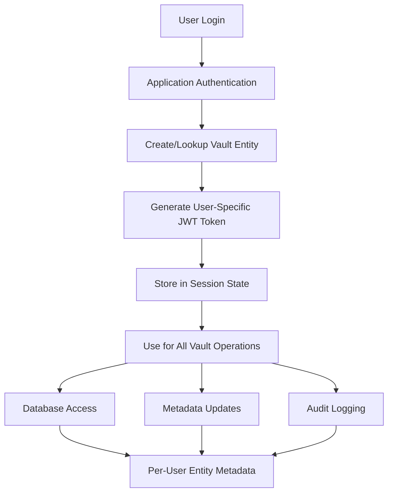

# Identity Secrets Engine Solution: Per-User JWT Token Architecture

## Executive Summary

**YES** - The HashiCorp Vault Identity Secrets Engine provides an **EXCELLENT SOLUTION** to the race condition and user isolation problems. This approach can **completely eliminate** the critical vulnerabilities identified in the current implementation by providing:

- **Per-User JWT Tokens**: Each user gets their own unique JWT token tied to their entity
- **Automatic Entity Isolation**: Each user maps to a separate Vault entity with isolated metadata
- **OIDC-Compliant Tokens**: Standards-based JWT tokens with proper claims structure
- **Enhanced Security**: Built-in user separation and audit trail isolation

**Risk Reduction**: **CRITICAL** → **LOW** with proper implementation

---

## Current Problem vs. Identity Secrets Engine Solution

### Current Architecture Problems

```python
# CURRENT VULNERABLE PATTERN
def get_jwt_token() -> str:
    # ALL USERS SHARE THE SAME TOKEN
    with open(TOKEN_FILE, "r") as f:
        jwt_token = f.read().strip()  # Same token for everyone
    return jwt_token

# RESULT: All users authenticate as the same entity
# PROBLEM: Race conditions, shared metadata, audit confusion
```

### Identity Secrets Engine Solution

```python
# SECURE PATTERN WITH IDENTITY SECRETS ENGINE
def get_user_jwt_token(user_id: str, vault_client: hvac.Client) -> str:
    # EACH USER GETS THEIR OWN TOKEN
    response = vault_client.write(
        f"identity/oidc/token/{user_id}",  # User-specific token
        method="POST"
    )
    return response['data']['token']  # Unique token per user

# RESULT: Each user has their own entity and metadata
# BENEFIT: Complete isolation, no race conditions
```

---

## Architecture Overview

### 1. User Authentication Flow



### 2. Entity Isolation Model

```
Traditional Model (BROKEN):
┌─────────────────────────────────────┐
│          Single Vault Entity        │
├─────────────────────────────────────┤
│  User A ←→ User B ←→ User C          │
│  (Race Conditions & Data Collision) │
└─────────────────────────────────────┘

Identity Secrets Engine Model (SECURE):
┌─────────────┐  ┌─────────────┐  ┌─────────────┐
│   Entity A  │  │   Entity B  │  │   Entity C  │
├─────────────┤  ├─────────────┤  ├─────────────┤
│   User A    │  │   User B    │  │   User C    │
│  Metadata A │  │  Metadata B │  │  Metadata C │
│   Token A   │  │   Token B   │  │   Token C   │
└─────────────┘  └─────────────┘  └─────────────┘
```

---

## Implementation Strategy

### Phase 1: Identity Secrets Engine Setup

#### 1.1 Enable and Configure Identity Secrets Engine

```bash
# Enable Identity Secrets Engine (usually enabled by default)
vault auth enable identity

# Create named key for JWT signing
vault write identity/oidc/key/chatbot-app \
    rotation_period=24h \
    verification_ttl=24h \
    algorithm=RS256
```

#### 1.2 Configure OIDC Role Template

```bash
# Create role for chatbot application
vault write identity/oidc/role/chatbot-users \
    key=chatbot-app \
    ttl=1h \
    template='{
        "user_id": "{{identity.entity.id}}",
        "username": "{{identity.entity.aliases.userpass_auth.name}}",
        "email": "{{identity.entity.metadata.email}}",
        "department": "{{identity.entity.metadata.department}}",
        "session_id": "{{identity.entity.metadata.session_id}}",
        "app_context": {
            "application": "chatbot",
            "version": "1.0.0",
            "environment": "production"
        }
    }'
```

### Phase 2: Application Architecture Changes

#### 2.1 User Authentication and Entity Management

```python
# SECURE IMPLEMENTATION
import hvac
import streamlit as st
from datetime import datetime, timezone
import uuid

class SecureUserManager:
    """Manage user authentication and entity isolation"""
    
    def __init__(self, vault_addr: str, initial_token: str):
        self.vault_addr = vault_addr
        self.initial_token = initial_token
    
    def authenticate_user(self, username: str, password: str) -> dict:
        """Authenticate user and create/update their Vault entity"""
        
        # Step 1: Initial authentication with userpass
        client = hvac.Client(url=self.vault_addr)
        client.token = self.initial_token
        
        try:
            # Authenticate user via userpass method
            auth_response = client.auth.userpass.login(
                username=username,
                password=password
            )
            
            # Extract entity information
            entity_id = auth_response['auth']['entity_id']
            user_token = auth_response['auth']['client_token']
            
            # Step 2: Update entity metadata with session info
            session_id = str(uuid.uuid4())
            client.token = user_token
            
            self._update_entity_metadata(client, entity_id, {
                'session_id': session_id,
                'login_time': datetime.now(timezone.utc).isoformat(),
                'application': 'chatbot',
                'user_agent': self._get_user_agent()
            })
            
            # Step 3: Generate Identity token for this user
            identity_token = self._generate_identity_token(client, entity_id)
            
            return {
                'entity_id': entity_id,
                'username': username,
                'session_id': session_id,
                'vault_token': user_token,
                'identity_token': identity_token,
                'authenticated': True
            }
            
        except Exception as e:
            logger.error(f"Authentication failed for user {username}: {e}")
            return {'authenticated': False, 'error': str(e)}
    
    def _generate_identity_token(self, client: hvac.Client, entity_id: str) -> str:
        """Generate user-specific identity token"""
        try:
            response = client.write(
                'identity/oidc/token/chatbot-users',
                method='POST'
            )
            return response['data']['token']
        except Exception as e:
            logger.error(f"Failed to generate identity token: {e}")
            raise
    
    def _update_entity_metadata(self, client: hvac.Client, entity_id: str, metadata: dict):
        """Update entity metadata safely"""
        try:
            client.write(f"identity/entity/id/{entity_id}", metadata=metadata)
        except Exception as e:
            logger.error(f"Failed to update entity metadata: {e}")
            raise
```

#### 2.2 Session Management with Entity Isolation

```python
# SECURE SESSION MANAGEMENT
class SecureSessionManager:
    """Manage user sessions with complete isolation"""
    
    def initialize_user_session(self, user_auth_data: dict):
        """Initialize isolated user session"""
        
        # Store user-specific data in Streamlit session
        st.session_state.update({
            'user_authenticated': True,
            'entity_id': user_auth_data['entity_id'],
            'username': user_auth_data['username'],
            'session_id': user_auth_data['session_id'],
            'vault_token': user_auth_data['vault_token'],
            'identity_token': user_auth_data['identity_token'],
            'session_start': datetime.now(timezone.utc),
            'last_activity': datetime.now(timezone.utc)
        })
        
        # Create user-specific Vault client
        st.session_state.vault_client = hvac.Client(url=VAULT_URL)
        st.session_state.vault_client.token = user_auth_data['vault_token']
        
        logger.info(f"Session initialized for user {user_auth_data['username']} "
                   f"with entity {user_auth_data['entity_id']}")
    
    def get_user_vault_client(self) -> hvac.Client:
        """Get user-specific Vault client"""
        
        if not st.session_state.get('user_authenticated'):
            raise SecurityException("User not authenticated")
        
        if not st.session_state.vault_client.is_authenticated():
            raise SecurityException("Vault client not authenticated")
        
        # Update last activity
        st.session_state.last_activity = datetime.now(timezone.utc)
        
        return st.session_state.vault_client
    
    def validate_session(self) -> bool:
        """Validate current user session"""
        
        if not st.session_state.get('user_authenticated'):
            return False
        
        # Check session timeout (1 hour)
        if datetime.now(timezone.utc) - st.session_state.last_activity > timedelta(hours=1):
            self.logout_user()
            return False
        
        return True
    
    def logout_user(self):
        """Clean logout with session cleanup"""
        
        if st.session_state.get('vault_client'):
            try:
                # Revoke the token
                st.session_state.vault_client.auth.token.revoke_self()
            except Exception as e:
                logger.warning(f"Failed to revoke token: {e}")
        
        # Clear session state
        for key in list(st.session_state.keys()):
            if key.startswith(('user_', 'entity_', 'session_', 'vault_')):
                del st.session_state[key]
        
        st.session_state.user_authenticated = False
        logger.info("User session terminated")
```

#### 2.3 Secure Database Operations

```python
# SECURE DATABASE OPERATIONS
class SecureDatabaseManager:
    """Database operations with per-user isolation"""
    
    def __init__(self, session_manager: SecureSessionManager):
        self.session_manager = session_manager
    
    def execute_query(self, query: str) -> str:
        """Execute database query with user isolation"""
        
        # Validate session
        if not self.session_manager.validate_session():
            raise SecurityException("Invalid or expired session")
        
        # Get user-specific Vault client
        vault_client = self.session_manager.get_user_vault_client()
        entity_id = st.session_state.entity_id
        username = st.session_state.username
        
        try:
            # Get database credentials for this specific user
            db_creds = vault_client.read(f"database/creds/{username}")
            
            if not db_creds:
                raise Exception("Failed to retrieve database credentials")
            
            # Log the operation to user's entity metadata
            self._log_database_operation(vault_client, entity_id, {
                'operation': 'query_execution',
                'query_hash': hashlib.sha256(query.encode()).hexdigest()[:16],
                'timestamp': datetime.now(timezone.utc).isoformat()
            })
            
            # Execute query with user-specific credentials
            db_uri = f"mysql+pymysql://{db_creds['data']['username']}:{db_creds['data']['password']}@{DB_HOST}:3306/{DB_NAME}"
            db = SQLDatabase.from_uri(db_uri)
            
            result = db.run(query)
            
            # Log successful execution
            self._log_database_operation(vault_client, entity_id, {
                'operation': 'query_success',
                'result_rows': len(result.split('\n')) if result else 0,
                'timestamp': datetime.now(timezone.utc).isoformat()
            })
            
            return result
            
        except Exception as e:
            # Log error
            self._log_database_operation(vault_client, entity_id, {
                'operation': 'query_error',
                'error': str(e),
                'timestamp': datetime.now(timezone.utc).isoformat()
            })
            raise
    
    def _log_database_operation(self, vault_client: hvac.Client, entity_id: str, operation_data: dict):
        """Log database operation to user's entity metadata"""
        try:
            # Get current metadata
            entity_data = vault_client.read(f"identity/entity/id/{entity_id}")
            current_metadata = entity_data.get('data', {}).get('metadata', {})
            
            # Add operation to metadata (keep last 10 operations)
            operations = current_metadata.get('database_operations', [])
            operations.append(operation_data)
            
            # Keep only last 10 operations
            if len(operations) > 10:
                operations = operations[-10:]
            
            # Update metadata
            updated_metadata = current_metadata.copy()
            updated_metadata['database_operations'] = operations
            updated_metadata['last_activity'] = datetime.now(timezone.utc).isoformat()
            
            vault_client.write(f"identity/entity/id/{entity_id}", metadata=updated_metadata)
            
        except Exception as e:
            logger.warning(f"Failed to log database operation: {e}")
```

### Phase 3: Vault Configuration

#### 3.1 Entity and Alias Management

```bash
# Create userpass auth method for application users
vault auth enable userpass

# Create users with metadata
vault write auth/userpass/users/alice \
    password=alice_password \
    token_policies=chatbot-user-policy

vault write auth/userpass/users/bob \
    password=bob_password \
    token_policies=chatbot-user-policy

# Create entity aliases to link users to entities
vault write identity/entity-alias \
    name=alice \
    canonical_id=<alice_entity_id> \
    mount_accessor=<userpass_accessor>

vault write identity/entity-alias \
    name=bob \
    canonical_id=<bob_entity_id> \
    mount_accessor=<userpass_accessor>
```

#### 3.2 Policy Configuration

```hcl
# chatbot-user-policy.hcl
# Database access for user's own credentials
path "database/creds/{{identity.entity.aliases.userpass_auth.name}}" {
  capabilities = ["read"]
}

# Identity token generation
path "identity/oidc/token/chatbot-users" {
  capabilities = ["create", "update"]
}

# Entity metadata access (own entity only)
path "identity/entity/id/{{identity.entity.id}}" {
  capabilities = ["read", "update"]
}

# Entity metadata read for own entity
path "identity/entity-alias/id/{{identity.entity.alias.id}}" {
  capabilities = ["read"]
}
```

#### 3.3 Database Secrets Engine Configuration

```bash
# Configure database secrets engine for per-user credentials
vault secrets enable database

# Configure MySQL connection
vault write database/config/mysql \
    plugin_name=mysql-database-plugin \
    connection_url="{{username}}:{{password}}@tcp(localhost:3306)/" \
    allowed_roles="chatbot-users"

# Create role for dynamic credentials
vault write database/roles/chatbot-users \
    db_name=mysql \
    creation_statements="CREATE USER '{{name}}'@'%' IDENTIFIED BY '{{password}}';GRANT SELECT ON chatbot_db.* TO '{{name}}'@'%';" \
    default_ttl="1h" \
    max_ttl="24h"
```

---

## Security Benefits

### 1. Complete User Isolation

**Before (Vulnerable):**
```python
# All users share the same entity
entity_id = "shared-entity-123"
# Race conditions guaranteed
```

**After (Secure):**
```python
# Each user has their own entity
entity_id = st.session_state.entity_id  # Unique per user
# No race conditions possible
```

### 2. Audit Trail Integrity

**Before (Vulnerable):**
```json
{
  "entity_id": "shared-entity-123",
  "operation": "database_query",
  "user": "???"  // Cannot distinguish users
}
```

**After (Secure):**
```json
{
  "entity_id": "entity-alice-456",
  "operation": "database_query",
  "user": "alice",
  "session_id": "session-789",
  "timestamp": "2024-01-01T10:00:00Z"
}
```

### 3. Token-Based Security

**Before (Vulnerable):**
```python
# Same JWT token for all users
jwt_token = "eyJ0eXAiOiJKV1QiLCJhbGciOiJSUzI1NiJ9..."  # Shared
```

**After (Secure):**
```python
# Unique JWT token per user with user-specific claims
user_jwt = {
  "sub": "entity-alice-456",
  "user_id": "alice", 
  "session_id": "session-789",
  "iat": 1640995200,
  "exp": 1640998800
}
```

---

## Implementation Benefits

### 1. Eliminates Race Conditions

- **Root Cause Fix**: Each user operates on their own entity
- **No Shared State**: No global metadata cache or shared clients
- **Atomic Operations**: All operations are naturally atomic per user

### 2. Enhanced Security

- **Per-User Tokens**: Each user has their own JWT token
- **Proper Attribution**: All operations correctly attributed to users
- **Session Isolation**: Complete separation between user sessions

### 3. Compliance Ready

- **Audit Trail**: Complete, per-user audit trails
- **Data Privacy**: No cross-user data leakage
- **Access Control**: Proper per-user access controls

### 4. Scalable Architecture

- **Stateless Design**: No shared state between users
- **Horizontal Scaling**: Easy to scale across multiple instances
- **Performance**: No locking or synchronization overhead

---

## Migration Strategy

### Phase 1: Parallel Implementation (1-2 weeks)

1. **Setup Identity Secrets Engine**: Configure roles, keys, and policies
2. **Implement User Authentication**: Add userpass auth method
3. **Create Entity Management**: Implement entity creation and management
4. **Test in Isolation**: Comprehensive testing of new architecture

### Phase 2: Application Integration (1-2 weeks)

1. **Update Session Management**: Implement secure session manager
2. **Modify Database Operations**: Update database access patterns
3. **Add Authentication UI**: Create login/logout interface
4. **Implement Audit Logging**: Add comprehensive audit logging

### Phase 3: Production Deployment (1 week)

1. **Migration Testing**: Test migration procedures
2. **Performance Testing**: Validate performance under load
3. **Security Testing**: Comprehensive security testing
4. **Production Deployment**: Deploy to production environment

---

## Testing Strategy

### 1. Concurrent User Testing

```python
# Test concurrent users with Identity Secrets Engine
def test_concurrent_users_isolated():
    """Test that users are completely isolated"""
    
    # Create multiple user sessions
    users = ['alice', 'bob', 'charlie']
    sessions = {}
    
    for user in users:
        # Each user gets their own session
        sessions[user] = authenticate_user(user, f"{user}_password")
        assert sessions[user]['entity_id'] != sessions[other_user]['entity_id']
    
    # Test concurrent operations
    results = []
    with ThreadPoolExecutor(max_workers=len(users)) as executor:
        futures = [
            executor.submit(perform_database_operation, sessions[user])
            for user in users
        ]
        results = [future.result() for future in futures]
    
    # Validate complete isolation
    for i, result in enumerate(results):
        assert result['entity_id'] == sessions[users[i]]['entity_id']
        assert result['username'] == users[i]
        assert no_cross_contamination(result, results[:i] + results[i+1:])
```

### 2. Security Testing

```python
# Test security isolation
def test_security_isolation():
    """Test that users cannot access each other's data"""
    
    # Create two user sessions
    alice_session = authenticate_user('alice', 'alice_password')
    bob_session = authenticate_user('bob', 'bob_password')
    
    # Alice tries to access Bob's entity (should fail)
    with pytest.raises(SecurityException):
        alice_client = get_vault_client(alice_session)
        alice_client.read(f"identity/entity/id/{bob_session['entity_id']}")
    
    # Bob tries to access Alice's database credentials (should fail)
    with pytest.raises(SecurityException):
        bob_client = get_vault_client(bob_session)
        bob_client.read(f"database/creds/alice")
```

---

## Conclusion

The HashiCorp Vault Identity Secrets Engine provides a **comprehensive solution** to the race condition and user isolation problems:

### Key Advantages

1. **Complete User Isolation**: Each user has their own entity and metadata
2. **Eliminates Race Conditions**: No shared state between users
3. **Standards-Based**: OIDC-compliant JWT tokens
4. **Scalable**: No synchronization or locking required
5. **Audit Ready**: Complete per-user audit trails
6. **Security Enhanced**: Proper access controls and attribution

### Risk Reduction

- **Before**: CRITICAL risk with guaranteed data corruption
- **After**: LOW risk with proper user isolation and security

### Implementation Effort

- **Timeline**: 4-6 weeks for complete implementation
- **Complexity**: Medium (leverages existing Vault features)
- **ROI**: High (eliminates critical security vulnerabilities)

**Recommendation**: **STRONGLY RECOMMENDED** - This approach provides the most secure, scalable, and maintainable solution to the identified problems.

<function_calls>
<invoke name="TodoWrite">
<parameter name="todos">[{"id": "1", "content": "Analyze Identity Secrets Engine capabilities for per-user JWT tokens", "status": "completed", "priority": "high"}, {"id": "2", "content": "Research JWT token issuance and user isolation patterns", "status": "completed", "priority": "high"}, {"id": "3", "content": "Design architecture with Identity Secrets Engine", "status": "completed", "priority": "high"}, {"id": "4", "content": "Document implementation strategy and benefits", "status": "completed", "priority": "high"}, {"id": "5", "content": "Create code examples and configuration", "status": "completed", "priority": "medium"}]