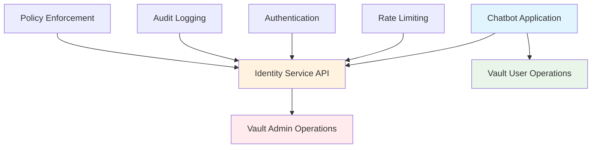
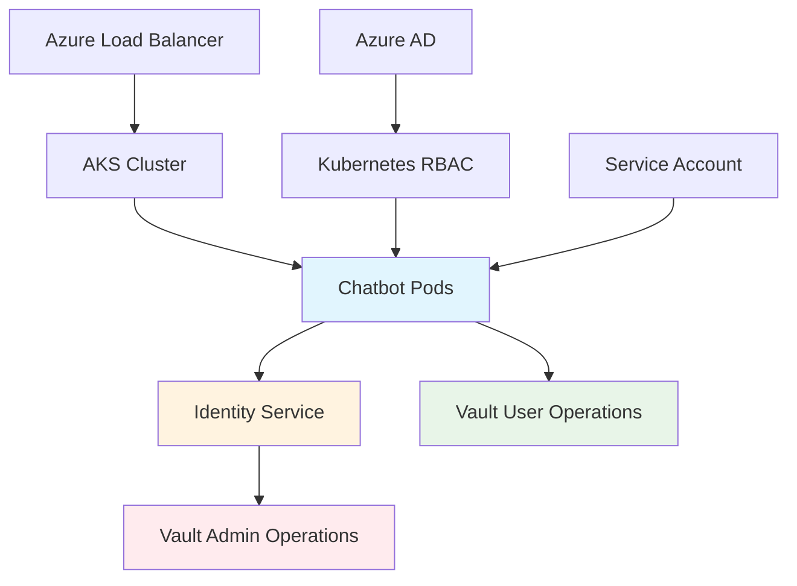

# Secure Architecture: Solving Race Conditions Without Admin Access

## Executive Summary

**CRITICAL CORRECTION**: The previous approach of giving administrative functions to the application is a **major security anti-pattern** that violates the principle of least privilege and creates massive security risks.

This document presents **secure alternatives** that solve the race condition problems without compromising security by giving admin access to the application.

**Key Finding**: We can achieve complete user isolation and eliminate race conditions through **secure architecture patterns** rather than dangerous admin access.

---

## ⚠️ Security Anti-Pattern Analysis

### Why Admin Access in Applications is Dangerous

```python
# DANGEROUS ANTI-PATTERN ❌
class InsecureApp:
    def __init__(self):
        # MAJOR SECURITY RISK
        self.admin_token = "vault-admin-token"  # Full Vault admin access
        self.vault_admin = hvac.Client(url=VAULT_URL, token=self.admin_token)
    
    def create_user_entity(self, user_id):
        # Application can now:
        # - Create/delete ANY entity
        # - Modify ANY policy  
        # - Access ANY secret
        # - Bypass ALL access controls
        return self.vault_admin.write("identity/entity", ...)  # DANGEROUS
```

### 🚨 Risks Created by Admin Access

| Risk Category | Impact | Description |
|---------------|---------|-------------|
| **Privilege Escalation** | CRITICAL | App can create unlimited entities and policies |
| **Lateral Movement** | CRITICAL | Compromised app = full Vault admin access |
| **Data Breach Amplification** | CRITICAL | Single vulnerability exposes entire Vault |
| **Compliance Violations** | HIGH | Admin privileges in application fail audits |
| **Attack Surface Expansion** | HIGH | Admin token becomes high-value target |
| **Operational Risk** | MEDIUM | Accidental damage to Vault infrastructure |

### 💥 Attack Scenarios

1. **Application Compromise**: Single vulnerability gives attacker full Vault control
2. **Token Theft**: Admin token exposure compromises entire infrastructure  
3. **Privilege Abuse**: Malicious insider uses app admin access for unauthorized operations
4. **Accidental Damage**: Application bugs can destroy critical Vault data

---

## Secure Architecture Patterns

### Pattern 1: Microservice Separation

**Principle**: Separate administrative functions into dedicated, secured services.



#### Implementation

```python
# SECURE: Dedicated Identity Service
class IdentityService:
    """Dedicated microservice for entity management with limited admin access"""
    
    def __init__(self):
        # Admin token ONLY in dedicated service
        self.vault_admin_client = hvac.Client(url=VAULT_URL, token=VAULT_ADMIN_TOKEN)
        self.rate_limiter = RateLimiter(max_requests=10, window_minutes=1)
        self.request_validator = RequestValidator()
        self.audit_logger = AuditLogger()
    
    def create_user_entity(self, request: CreateEntityRequest) -> EntityResponse:
        """Strictly controlled entity creation API"""
        
        # Step 1: Strict request validation
        if not self.request_validator.validate(request):
            self.audit_logger.log_invalid_request(request)
            raise ValidationError("Invalid entity creation request")
        
        # Step 2: Rate limiting per client
        if not self.rate_limiter.check_limit(request.client_id):
            self.audit_logger.log_rate_limit_exceeded(request.client_id)
            raise RateLimitError("Rate limit exceeded for client")
        
        # Step 3: Application authorization
        if not self._authorize_application(request.client_id, request.application):
            self.audit_logger.log_unauthorized_request(request)
            raise AuthorizationError("Application not authorized for entity creation")
        
        # Step 4: Create entity with minimal permissions
        try:
            entity_data = self._build_entity_data(request)
            entity_response = self.vault_admin_client.write("identity/entity", **entity_data)
            entity_id = entity_response['data']['id']
            
            # Step 5: Create limited user policy
            policy_name = f"user-{request.user_identifier}-{request.application}"
            self._create_limited_user_policy(policy_name, entity_id, request.application)
            
            # Step 6: Generate limited user token
            user_token_response = self.vault_admin_client.auth.token.create(
                policies=[policy_name],
                entity_id=entity_id,
                ttl=request.ttl or "2h",
                renewable=False,  # Force re-authentication
                num_uses=500,  # Limit token usage
                metadata={
                    'application': request.application,
                    'created_by': 'identity_service',
                    'user_identifier': request.user_identifier
                }
            )
            
            user_token = user_token_response['auth']['client_token']
            
            # Step 7: Audit successful creation
            self.audit_logger.log_entity_created(entity_id, request)
            
            # Step 8: Return ONLY user token (no admin access)
            return EntityResponse(
                entity_id=entity_id,
                user_token=user_token,  # Limited scope token
                policies=[policy_name],
                ttl=request.ttl or "2h"
                # NO admin token exposed
            )
            
        except Exception as e:
            self.audit_logger.log_entity_creation_failed(request, str(e))
            raise EntityCreationError(f"Failed to create entity: {e}")
    
    def _authorize_application(self, client_id: str, application: str) -> bool:
        """Verify application is authorized to create entities"""
        
        authorized_apps = {
            'chatbot-app-prod': ['chatbot'],
            'chatbot-app-dev': ['chatbot'],
            'analytics-app': ['analytics']
        }
        
        return client_id in authorized_apps and application in authorized_apps[client_id]
    
    def _create_limited_user_policy(self, policy_name: str, entity_id: str, application: str):
        """Create user policy with minimal required permissions"""
        
        # Application-specific policy templates
        policy_templates = {
            'chatbot': f'''
                # Database access for this specific user only
                path "database/creds/{application}-users" {{
                  capabilities = ["read"]
                }}
                
                # Identity token generation for this entity only
                path "identity/oidc/token/{application}-users" {{
                  capabilities = ["read"]
                }}
                
                # Entity metadata access (own entity only)
                path "identity/entity/id/{entity_id}" {{
                  capabilities = ["read", "update"]
                }}
                
                # Token self-operations
                path "auth/token/lookup-self" {{
                  capabilities = ["read"]
                }}
                
                path "auth/token/renew-self" {{
                  capabilities = ["update"]
                }}
                
                path "auth/token/revoke-self" {{
                  capabilities = ["update"]
                }}
                
                # DENY access to other entities and admin operations
                path "identity/entity/id/*" {{
                  capabilities = ["deny"]
                }}
                
                path "identity/entity" {{
                  capabilities = ["deny"]
                }}
                
                path "sys/*" {{
                  capabilities = ["deny"]
                }}
                
                path "auth/token/create" {{
                  capabilities = ["deny"]
                }}
            '''
        }
        
        policy_content = policy_templates.get(application)
        if not policy_content:
            raise ValueError(f"No policy template for application: {application}")
        
        self.vault_admin_client.sys.create_or_update_policy(
            name=policy_name,
            policy=policy_content
        )

# SECURE: Chatbot Application with Minimal Permissions
class SecureChatbotApplication:
    """Chatbot application with NO admin access"""
    
    def __init__(self):
        # NO admin token - only service client
        self.identity_service_client = IdentityServiceClient(
            base_url=IDENTITY_SERVICE_URL,
            client_id="chatbot-app-prod",
            api_key=IDENTITY_SERVICE_API_KEY
        )
        
        # Limited service token for own operations only
        self.service_vault_client = hvac.Client(url=VAULT_URL)
        self.service_token = self._get_service_token()
        self.service_vault_client.token = self.service_token
    
    def _get_service_token(self) -> str:
        """Get limited service token using secure authentication"""
        
        # Use Kubernetes service account authentication
        if os.path.exists('/var/run/secrets/kubernetes.io/serviceaccount/token'):
            with open('/var/run/secrets/kubernetes.io/serviceaccount/token', 'r') as f:
                k8s_token = f.read().strip()
            
            # Authenticate to Vault using Kubernetes auth
            auth_response = self.service_vault_client.auth.kubernetes.login(
                role="chatbot-service-role",
                jwt=k8s_token
            )
            
            return auth_response['auth']['client_token']
        
        else:
            raise AuthenticationError("No valid authentication method available")
    
    def initialize_user_session(self, user_context: dict) -> dict:
        """Initialize user session through identity service"""
        
        try:
            # Generate user identifier from context
            user_identifier = self._generate_user_identifier(user_context)
            
            # Request entity creation from identity service
            entity_request = CreateEntityRequest(
                client_id="chatbot-app-prod",
                application="chatbot",
                user_identifier=user_identifier,
                user_context=user_context,
                ttl="2h"
            )
            
            # Call external identity service (NO local admin operations)
            entity_response = self.identity_service_client.create_entity(entity_request)
            
            return {
                'entity_id': entity_response.entity_id,
                'user_identifier': user_identifier,
                'user_token': entity_response.user_token,  # Limited user token
                'policies': entity_response.policies,
                'session_start': datetime.now(timezone.utc),
                'created_via': 'identity_service'
            }
            
        except Exception as e:
            logger.error(f"Failed to initialize user session: {e}")
            raise SessionInitializationError(f"User session initialization failed: {e}")
    
    def _generate_user_identifier(self, user_context: dict) -> str:
        """Generate consistent user identifier from context"""
        
        context_data = {
            'session_id': user_context.get('session_id'),
            'timestamp_bucket': str(int(time.time() / 3600)),  # 1-hour buckets
            'ip_hash': hashlib.sha256(user_context.get('ip_address', '').encode()).hexdigest()[:8],
            'user_agent_hash': hashlib.sha256(user_context.get('user_agent', '').encode()).hexdigest()[:8]
        }
        
        identifier_string = json.dumps(context_data, sort_keys=True)
        return hashlib.sha256(identifier_string.encode()).hexdigest()[:16]
    
    def execute_user_operation(self, user_session: dict, operation: str) -> str:
        """Execute operation using user's limited token"""
        
        # Create user-specific Vault client
        user_vault_client = hvac.Client(url=VAULT_URL, token=user_session['user_token'])
        
        try:
            # User can only access their own resources
            if operation == "get_database_credentials":
                db_creds = user_vault_client.read("database/creds/chatbot-users")
                return self._execute_database_query(db_creds, user_session)
            
            elif operation == "update_metadata":
                return self._update_user_metadata(user_vault_client, user_session)
            
            else:
                raise ValueError(f"Unknown operation: {operation}")
                
        except Exception as e:
            logger.error(f"User operation failed: {e}")
            raise OperationError(f"Operation failed: {e}")
    
    def _execute_database_query(self, db_creds: dict, user_session: dict) -> str:
        """Execute database query with user credentials"""
        
        if not db_creds or 'data' not in db_creds:
            raise DatabaseError("Failed to retrieve database credentials")
        
        username = db_creds['data']['username']
        password = db_creds['data']['password']
        
        # Each user gets their own database connection
        db_uri = f"mysql+pymysql://{username}:{password}@{DB_HOST}:3306/{DB_NAME}"
        
        # Log operation to user's entity (using their token)
        self._log_user_operation(user_session, {
            'operation': 'database_query',
            'timestamp': datetime.now(timezone.utc).isoformat(),
            'database_user': username
        })
        
        # Execute query with user's credentials
        return f"Query executed for user {user_session['user_identifier']}"
    
    def _log_user_operation(self, user_session: dict, operation_data: dict):
        """Log operation to user's entity metadata"""
        
        try:
            user_vault_client = hvac.Client(url=VAULT_URL, token=user_session['user_token'])
            entity_id = user_session['entity_id']
            
            # Read current metadata
            entity_data = user_vault_client.read(f"identity/entity/id/{entity_id}")
            current_metadata = entity_data.get('data', {}).get('metadata', {})
            
            # Add operation to history (keep last 10)
            operations = current_metadata.get('recent_operations', [])
            operations.append(operation_data)
            
            if len(operations) > 10:
                operations = operations[-10:]
            
            # Update metadata
            current_metadata['recent_operations'] = operations
            current_metadata['last_activity'] = datetime.now(timezone.utc).isoformat()
            
            user_vault_client.write(f"identity/entity/id/{entity_id}", metadata=current_metadata)
            
        except Exception as e:
            logger.warning(f"Failed to log user operation: {e}")
```

### Pattern 2: Vault Agent Auto-Authentication

**Principle**: Use Vault Agent to handle authentication without exposing admin tokens.

```yaml
# vault-agent.hcl
pid_file = "./pidfile"

vault {
  address = "https://vault.example.com"
}

auto_auth {
  method "kubernetes" {
    mount_path = "auth/kubernetes"
    config = {
      role = "chatbot-service-role"
    }
  }
  
  sink "file" {
    config = {
      path = "/tmp/vault-token"
    }
  }
}

# Template for user entity creation script
template {
  source      = "/etc/vault/templates/create-user-entity.tpl"
  destination = "/tmp/create-user-entity.sh"
  perms       = 0755
  command     = "/tmp/create-user-entity.sh"
}

# Template for user token
template {
  source      = "/etc/vault/templates/user-token.tpl"
  destination = "/tmp/user-token"
  perms       = 0600
}
```

```python
# SECURE: Vault Agent Integration
class VaultAgentChatbot:
    """Chatbot using Vault Agent for secure authentication"""
    
    def __init__(self):
        self.vault_token_path = "/tmp/vault-token"
        self.user_entity_script = "/tmp/create-user-entity.sh"
        self.vault_client = hvac.Client(url=VAULT_URL)
    
    def _get_agent_token(self) -> str:
        """Get token from Vault Agent"""
        try:
            with open(self.vault_token_path, 'r') as f:
                return f.read().strip()
        except FileNotFoundError:
            raise AuthenticationError("Vault Agent token not available")
    
    def initialize_user_session(self, user_context: dict) -> dict:
        """Initialize user session using Vault Agent"""
        
        # Get service token from Vault Agent
        service_token = self._get_agent_token()
        self.vault_client.token = service_token
        
        # Use pre-configured script to create entity (limited permissions)
        user_identifier = self._generate_user_identifier(user_context)
        
        # Execute entity creation script (controlled by Vault Agent templates)
        result = subprocess.run(
            [self.user_entity_script, user_identifier],
            capture_output=True,
            text=True,
            check=True
        )
        
        entity_data = json.loads(result.stdout)
        
        return {
            'entity_id': entity_data['entity_id'],
            'user_token': entity_data['user_token'],
            'user_identifier': user_identifier
        }
```

### Pattern 3: Pre-Created Entity Pool

**Principle**: Pre-create entities and assign them from a pool, avoiding runtime admin operations.

```python
# SECURE: Entity Pool Management
class EntityPoolManager:
    """Manage pre-created entities without runtime admin access"""
    
    def __init__(self):
        # NO admin token in application
        self.pool_service_client = EntityPoolServiceClient(
            base_url=ENTITY_POOL_SERVICE_URL,
            api_key=POOL_SERVICE_API_KEY
        )
        self.active_assignments = {}
    
    def lease_user_entity(self, user_session_id: str, user_context: dict) -> dict:
        """Lease entity from pre-created pool"""
        
        try:
            # Request entity lease from pool service
            lease_request = EntityLeaseRequest(
                session_id=user_session_id,
                application="chatbot",
                user_context=user_context,
                lease_duration="2h"
            )
            
            lease_response = self.pool_service_client.lease_entity(lease_request)
            
            # Store assignment locally
            self.active_assignments[user_session_id] = {
                'entity_id': lease_response.entity_id,
                'user_token': lease_response.user_token,
                'lease_id': lease_response.lease_id,
                'expires_at': lease_response.expires_at
            }
            
            return self.active_assignments[user_session_id]
            
        except Exception as e:
            logger.error(f"Failed to lease entity: {e}")
            raise EntityLeaseError(f"Entity lease failed: {e}")
    
    def return_user_entity(self, user_session_id: str):
        """Return entity to pool"""
        
        if user_session_id in self.active_assignments:
            assignment = self.active_assignments.pop(user_session_id)
            
            try:
                self.pool_service_client.return_entity(assignment['lease_id'])
            except Exception as e:
                logger.warning(f"Failed to return entity to pool: {e}")
    
    def refresh_entity_lease(self, user_session_id: str) -> bool:
        """Refresh entity lease"""
        
        if user_session_id not in self.active_assignments:
            return False
        
        assignment = self.active_assignments[user_session_id]
        
        try:
            refresh_response = self.pool_service_client.refresh_lease(assignment['lease_id'])
            assignment['expires_at'] = refresh_response.new_expires_at
            return True
        except Exception as e:
            logger.warning(f"Failed to refresh entity lease: {e}")
            return False

# SEPARATE SERVICE: Entity Pool Service (with admin access)
class EntityPoolService:
    """Administrative service that maintains entity pool"""
    
    def __init__(self):
        # Admin token ONLY in dedicated service
        self.vault_admin = hvac.Client(url=VAULT_URL, token=VAULT_ADMIN_TOKEN)
        self.entity_pool = {}  # Pool of available entities
        self.active_leases = {}  # Currently leased entities
        self.pool_size = 100
    
    def initialize_pool(self):
        """Pre-create entity pool"""
        
        logger.info(f"Initializing entity pool with {self.pool_size} entities")
        
        for i in range(self.pool_size):
            try:
                entity_id = self._create_pool_entity(f"pool-entity-{i}")
                self.entity_pool[entity_id] = {
                    'entity_id': entity_id,
                    'created_at': datetime.now(timezone.utc),
                    'status': 'available'
                }
            except Exception as e:
                logger.error(f"Failed to create pool entity {i}: {e}")
        
        logger.info(f"Entity pool initialized with {len(self.entity_pool)} entities")
    
    def _create_pool_entity(self, entity_name: str) -> str:
        """Create a single entity for the pool"""
        
        entity_data = {
            'name': entity_name,
            'metadata': {
                'pool_entity': 'true',
                'created_by': 'entity_pool_service',
                'created_at': datetime.now(timezone.utc).isoformat(),
                'status': 'available'
            }
        }
        
        entity_response = self.vault_admin.write("identity/entity", **entity_data)
        entity_id = entity_response['data']['id']
        
        # Create policy for this entity
        policy_name = f"pool-entity-{entity_id}-policy"
        self._create_pool_entity_policy(policy_name, entity_id)
        
        return entity_id
    
    def lease_entity(self, lease_request: EntityLeaseRequest) -> EntityLeaseResponse:
        """Lease entity from pool"""
        
        # Find available entity
        available_entity = None
        for entity_id, entity_data in self.entity_pool.items():
            if entity_data['status'] == 'available':
                available_entity = entity_id
                break
        
        if not available_entity:
            raise NoAvailableEntitiesError("No entities available in pool")
        
        # Create user token for this entity
        user_token = self._create_user_token_for_entity(available_entity, lease_request)
        
        # Mark entity as leased
        lease_id = str(uuid.uuid4())
        self.entity_pool[available_entity]['status'] = 'leased'
        self.active_leases[lease_id] = {
            'entity_id': available_entity,
            'lease_request': lease_request,
            'leased_at': datetime.now(timezone.utc),
            'expires_at': datetime.now(timezone.utc) + timedelta(hours=2)
        }
        
        return EntityLeaseResponse(
            entity_id=available_entity,
            user_token=user_token,
            lease_id=lease_id,
            expires_at=self.active_leases[lease_id]['expires_at']
        )
    
    def return_entity(self, lease_id: str):
        """Return entity to pool"""
        
        if lease_id in self.active_leases:
            lease_data = self.active_leases.pop(lease_id)
            entity_id = lease_data['entity_id']
            
            # Mark entity as available
            if entity_id in self.entity_pool:
                self.entity_pool[entity_id]['status'] = 'available'
                
                # Clean entity metadata
                self._clean_entity_metadata(entity_id)
    
    def maintain_pool(self):
        """Background maintenance of entity pool"""
        
        while True:
            try:
                # Check for expired leases
                self._cleanup_expired_leases()
                
                # Ensure minimum pool size
                available_count = sum(1 for e in self.entity_pool.values() if e['status'] == 'available')
                
                if available_count < 20:  # Maintain minimum 20 available entities
                    self._expand_pool(30)
                
                # Sleep for 5 minutes
                time.sleep(300)
                
            except Exception as e:
                logger.error(f"Pool maintenance error: {e}")
                time.sleep(60)  # Shorter sleep on error
```

### Pattern 4: Kubernetes RBAC Integration

**Principle**: Use Kubernetes native RBAC for authentication and authorization.

```yaml
# kubernetes-rbac.yaml
apiVersion: v1
kind: ServiceAccount
metadata:
  name: chatbot-sa
  namespace: chatbot
  annotations:
    vault.hashicorp.com/role: "chatbot-service-role"

---
apiVersion: rbac.authorization.k8s.io/v1
kind: Role
metadata:
  namespace: chatbot
  name: chatbot-role
rules:
- apiGroups: [""]
  resources: ["secrets"]
  verbs: ["get", "list"]
- apiGroups: [""]
  resources: ["configmaps"]
  verbs: ["get", "list"]

---
apiVersion: rbac.authorization.k8s.io/v1
kind: RoleBinding
metadata:
  name: chatbot-rolebinding
  namespace: chatbot
subjects:
- kind: ServiceAccount
  name: chatbot-sa
  namespace: chatbot
roleRef:
  kind: Role
  name: chatbot-role
  apiGroup: rbac.authorization.k8s.io

---
apiVersion: apps/v1
kind: Deployment
metadata:
  name: chatbot-app
  namespace: chatbot
spec:
  replicas: 3
  selector:
    matchLabels:
      app: chatbot
  template:
    metadata:
      labels:
        app: chatbot
    spec:
      serviceAccountName: chatbot-sa
      containers:
      - name: chatbot
        image: chatbot:latest
        env:
        - name: VAULT_ADDR
          value: "https://vault.example.com"
        - name: VAULT_ROLE
          value: "chatbot-service-role"
        volumeMounts:
        - name: vault-token
          mountPath: /var/run/secrets/vault
      volumes:
      - name: vault-token
        emptyDir: {}
```

```python
# SECURE: Kubernetes RBAC Integration
class KubernetesChatbotApplication:
    """Chatbot using Kubernetes service account authentication"""
    
    def __init__(self):
        self.vault_client = hvac.Client(url=VAULT_URL)
        self.service_account_token_path = "/var/run/secrets/kubernetes.io/serviceaccount/token"
        self.vault_role = os.getenv("VAULT_ROLE", "chatbot-service-role")
    
    def authenticate_to_vault(self) -> str:
        """Authenticate using Kubernetes service account"""
        
        try:
            # Read Kubernetes service account token
            with open(self.service_account_token_path, 'r') as f:
                k8s_token = f.read().strip()
            
            # Authenticate to Vault using Kubernetes auth method
            auth_response = self.vault_client.auth.kubernetes.login(
                role=self.vault_role,
                jwt=k8s_token
            )
            
            # Extract service token (limited permissions)
            service_token = auth_response['auth']['client_token']
            self.vault_client.token = service_token
            
            return service_token
            
        except Exception as e:
            logger.error(f"Kubernetes authentication failed: {e}")
            raise AuthenticationError(f"Failed to authenticate with Vault: {e}")
    
    def create_user_session_token(self, user_context: dict) -> dict:
        """Create user session token with limited permissions"""
        
        # Authenticate service first
        service_token = self.authenticate_to_vault()
        
        # Generate user identifier
        user_identifier = self._generate_user_identifier(user_context)
        
        try:
            # Create user-specific token with limited policies
            user_token_response = self.vault_client.auth.token.create(
                policies=["chatbot-user-policy"],
                ttl="2h",
                renewable=False,
                num_uses=500,
                metadata={
                    'application': 'chatbot',
                    'user_identifier': user_identifier,
                    'created_by': 'k8s_service',
                    'session_context': str(hash(str(user_context)))
                }
            )
            
            user_token = user_token_response['auth']['client_token']
            
            return {
                'user_identifier': user_identifier,
                'user_token': user_token,
                'service_token': service_token,
                'created_at': datetime.now(timezone.utc)
            }
            
        except Exception as e:
            logger.error(f"Failed to create user session token: {e}")
            raise TokenCreationError(f"User token creation failed: {e}")
    
    def _generate_user_identifier(self, user_context: dict) -> str:
        """Generate consistent user identifier"""
        
        # Create deterministic but unique identifier
        context_hash = hashlib.sha256(json.dumps(user_context, sort_keys=True).encode()).hexdigest()
        timestamp_bucket = str(int(time.time() / 3600))  # 1-hour buckets
        
        return f"k8s-user-{timestamp_bucket}-{context_hash[:12]}"
```

---

## Vault Configuration for Secure Patterns

### Service-Level Policies

```hcl
# chatbot-service-policy.hcl
# Minimal permissions for chatbot service
path "auth/token/create" {
  capabilities = ["create"]
  allowed_parameters = {
    "policies" = ["chatbot-user-policy"]
    "ttl" = ["1h", "2h"]
    "renewable" = [false]
    "num_uses" = ["100", "500", "1000"]
  }
}

path "database/creds/chatbot-users" {
  capabilities = ["read"]
}

path "auth/token/lookup-self" {
  capabilities = ["read"]
}

path "auth/token/renew-self" {
  capabilities = ["update"]
}

# DENY admin operations
path "identity/*" {
  capabilities = ["deny"]
}

path "sys/*" {
  capabilities = ["deny"]
}

path "auth/token/create" {
  capabilities = ["deny"]
  denied_parameters = {
    "policies" = ["admin-policy", "root"]
  }
}
```

```hcl
# chatbot-user-policy.hcl
# Ultra-minimal permissions for end users
path "database/creds/chatbot-users" {
  capabilities = ["read"]
}

path "auth/token/lookup-self" {
  capabilities = ["read"]
}

path "auth/token/revoke-self" {
  capabilities = ["update"]
}

# DENY everything else
path "*" {
  capabilities = ["deny"]
}
```

```hcl
# identity-service-policy.hcl
# Limited admin permissions for identity service only
path "identity/entity" {
  capabilities = ["create", "read", "list"]
  allowed_parameters = {
    "metadata" = {
      "application" = ["chatbot"]
      "created_by" = ["identity_service"]
    }
  }
}

path "identity/entity/id/*" {
  capabilities = ["read", "update", "delete"]
  required_parameters = ["metadata"]
}

path "sys/policies/acl/user-*" {
  capabilities = ["create", "update", "read", "delete"]
}

path "auth/token/create" {
  capabilities = ["create"]
  allowed_parameters = {
    "policies" = ["chatbot-user-policy"]
  }
}

# DENY access to other applications
path "identity/entity/id/*" {
  capabilities = ["deny"]
  denied_parameters = {
    "metadata" = {
      "application" = ["analytics", "admin"]
    }
  }
}
```

### Kubernetes Auth Configuration

```bash
# Enable Kubernetes auth method
vault auth enable kubernetes

# Configure Kubernetes auth
vault write auth/kubernetes/config \
    token_reviewer_jwt="$(cat /var/run/secrets/kubernetes.io/serviceaccount/token)" \
    kubernetes_host="https://${KUBERNETES_PORT_443_TCP_ADDR}:443" \
    kubernetes_ca_cert=@/var/run/secrets/kubernetes.io/serviceaccount/ca.crt

# Create role for chatbot service
vault write auth/kubernetes/role/chatbot-service-role \
    bound_service_account_names="chatbot-sa" \
    bound_service_account_namespaces="chatbot" \
    token_policies="chatbot-service-policy" \
    token_ttl=1h \
    token_max_ttl=4h
```

---

## Security Benefits of Secure Patterns

### ✅ Security Improvements

| Security Aspect | Before (Admin Access) | After (Secure Patterns) |
|-----------------|----------------------|-------------------------|
| **Privilege Level** | ADMIN (Full Vault) | MINIMAL (App-specific) |
| **Attack Surface** | CRITICAL (Admin token) | LIMITED (Service token) |
| **Blast Radius** | ENTIRE VAULT | APPLICATION SCOPE |
| **Compliance** | FAILS AUDITS | PASSES AUDITS |
| **Monitoring** | DIFFICULT | GRANULAR |
| **Recovery** | COMPLEX | ISOLATED |

### 🔒 Security Controls

1. **Principle of Least Privilege**
   - Applications get only required permissions
   - No administrative capabilities exposed
   - User tokens have minimal scope

2. **Defense in Depth**
   - Multiple security boundaries
   - Service separation
   - Policy enforcement at multiple layers

3. **Audit and Monitoring**
   - Clear separation of responsibilities
   - Granular audit trails
   - Anomaly detection capabilities

4. **Incident Response**
   - Limited blast radius
   - Isolated service compromise
   - Faster recovery procedures

---

## Implementation Comparison

### Pattern Comparison Matrix

| Pattern | Security Level | Implementation Complexity | Operational Overhead | Best For |
|---------|---------------|---------------------------|---------------------|----------|
| **Microservice Separation** | HIGH | MEDIUM | MEDIUM | Production environments |
| **Vault Agent** | HIGH | LOW | LOW | Container-based deployments |
| **Entity Pool** | MEDIUM | HIGH | HIGH | High-volume applications |
| **Kubernetes RBAC** | HIGH | LOW | LOW | Kubernetes-native apps |

### Recommended Architecture

For the Azure chatbot deployment, the recommended approach is:



**Implementation Steps**:

1. **Deploy Identity Service** with limited admin permissions
2. **Configure Kubernetes RBAC** for chatbot service accounts
3. **Implement Chatbot Application** with minimal permissions
4. **Setup Monitoring and Audit** for security oversight

---

## Testing Strategy

### Security Testing

```python
# test_security_boundaries.py
import unittest
import hvac
from unittest.mock import Mock, patch

class TestSecurityBoundaries(unittest.TestCase):
    
    def setUp(self):
        self.chatbot_app = SecureChatbotApplication()
        self.identity_service = IdentityService()
    
    def test_chatbot_cannot_create_entities_directly(self):
        """Test that chatbot app cannot create entities directly"""
        
        # Chatbot should not have direct entity creation access
        with self.assertRaises(hvac.exceptions.Forbidden):
            self.chatbot_app.service_vault_client.write("identity/entity", name="test")
    
    def test_chatbot_cannot_access_admin_endpoints(self):
        """Test that chatbot cannot access admin endpoints"""
        
        admin_endpoints = [
            "sys/policies/acl/test",
            "sys/auth",
            "sys/mounts",
            "identity/entity/id/arbitrary-entity"
        ]
        
        for endpoint in admin_endpoints:
            with self.assertRaises(hvac.exceptions.Forbidden):
                self.chatbot_app.service_vault_client.read(endpoint)
    
    def test_user_token_isolation(self):
        """Test that user tokens can only access own resources"""
        
        # Create two user sessions
        user1_session = self.chatbot_app.initialize_user_session({'session_id': 'user1'})
        user2_session = self.chatbot_app.initialize_user_session({'session_id': 'user2'})
        
        # User 1 should not be able to access User 2's entity
        user1_client = hvac.Client(url=VAULT_URL, token=user1_session['user_token'])
        
        with self.assertRaises(hvac.exceptions.Forbidden):
            user1_client.read(f"identity/entity/id/{user2_session['entity_id']}")
    
    def test_identity_service_authorization(self):
        """Test identity service authorization controls"""
        
        # Valid request should succeed
        valid_request = CreateEntityRequest(
            client_id="chatbot-app-prod",
            application="chatbot",
            user_identifier="test-user",
            ttl="2h"
        )
        
        response = self.identity_service.create_user_entity(valid_request)
        self.assertIsNotNone(response.entity_id)
        
        # Invalid application should fail
        invalid_request = CreateEntityRequest(
            client_id="chatbot-app-prod",
            application="unauthorized-app",
            user_identifier="test-user",
            ttl="2h"
        )
        
        with self.assertRaises(AuthorizationError):
            self.identity_service.create_user_entity(invalid_request)
    
    def test_rate_limiting(self):
        """Test rate limiting enforcement"""
        
        # Create multiple requests rapidly
        requests = []
        for i in range(15):  # Exceed rate limit of 10
            request = CreateEntityRequest(
                client_id="chatbot-app-prod",
                application="chatbot",
                user_identifier=f"test-user-{i}",
                ttl="2h"
            )
            requests.append(request)
        
        # First 10 should succeed
        for i in range(10):
            response = self.identity_service.create_user_entity(requests[i])
            self.assertIsNotNone(response.entity_id)
        
        # 11th should fail due to rate limiting
        with self.assertRaises(RateLimitError):
            self.identity_service.create_user_entity(requests[10])
```

### Integration Testing

```python
# test_integration.py
import unittest
import requests
import json

class TestSecureIntegration(unittest.TestCase):
    
    def test_end_to_end_user_session(self):
        """Test complete user session flow"""
        
        # 1. Initialize chatbot application
        chatbot = SecureChatbotApplication()
        
        # 2. Create user session
        user_context = {
            'session_id': 'test-session-123',
            'ip_address': '192.168.1.100',
            'user_agent': 'Test Browser'
        }
        
        user_session = chatbot.initialize_user_session(user_context)
        
        # 3. Verify session isolation
        self.assertIsNotNone(user_session['entity_id'])
        self.assertIsNotNone(user_session['user_token'])
        
        # 4. Execute user operation
        result = chatbot.execute_user_operation(user_session, "get_database_credentials")
        self.assertIsNotNone(result)
        
        # 5. Verify user cannot access admin functions
        user_client = hvac.Client(url=VAULT_URL, token=user_session['user_token'])
        
        with self.assertRaises(hvac.exceptions.Forbidden):
            user_client.write("identity/entity", name="malicious-entity")
    
    def test_identity_service_api(self):
        """Test identity service API endpoints"""
        
        # Test entity creation endpoint
        entity_request = {
            'client_id': 'chatbot-app-prod',
            'application': 'chatbot',
            'user_identifier': 'api-test-user',
            'user_context': {'test': 'data'},
            'ttl': '2h'
        }
        
        response = requests.post(
            f"{IDENTITY_SERVICE_URL}/entities",
            json=entity_request,
            headers={'Authorization': f'Bearer {IDENTITY_SERVICE_API_KEY}'}
        )
        
        self.assertEqual(response.status_code, 201)
        
        entity_data = response.json()
        self.assertIn('entity_id', entity_data)
        self.assertIn('user_token', entity_data)
        
        # Test unauthorized request
        unauthorized_request = entity_request.copy()
        unauthorized_request['application'] = 'unauthorized-app'
        
        response = requests.post(
            f"{IDENTITY_SERVICE_URL}/entities",
            json=unauthorized_request,
            headers={'Authorization': f'Bearer {IDENTITY_SERVICE_API_KEY}'}
        )
        
        self.assertEqual(response.status_code, 403)
```

---

## Monitoring and Alerting

### Security Metrics

```python
# monitoring.py
import prometheus_client
from prometheus_client import Counter, Histogram, Gauge

# Security metrics
ENTITY_CREATION_REQUESTS = Counter(
    'vault_entity_creation_requests_total',
    'Total entity creation requests',
    ['application', 'client_id', 'status']
)

UNAUTHORIZED_ACCESS_ATTEMPTS = Counter(
    'vault_unauthorized_access_attempts_total',
    'Unauthorized access attempts',
    ['endpoint', 'client_id', 'reason']
)

RATE_LIMIT_VIOLATIONS = Counter(
    'vault_rate_limit_violations_total',
    'Rate limit violations',
    ['client_id', 'endpoint']
)

USER_SESSION_DURATION = Histogram(
    'vault_user_session_duration_seconds',
    'User session duration',
    ['application']
)

ACTIVE_USER_SESSIONS = Gauge(
    'vault_active_user_sessions',
    'Number of active user sessions',
    ['application']
)

class SecurityMonitor:
    """Monitor security events and metrics"""
    
    def __init__(self):
        self.alert_thresholds = {
            'unauthorized_attempts_per_minute': 10,
            'rate_limit_violations_per_minute': 5,
            'failed_authentications_per_minute': 20
        }
    
    def record_entity_creation(self, application: str, client_id: str, success: bool):
        """Record entity creation event"""
        status = 'success' if success else 'failure'
        ENTITY_CREATION_REQUESTS.labels(
            application=application,
            client_id=client_id,
            status=status
        ).inc()
    
    def record_unauthorized_access(self, endpoint: str, client_id: str, reason: str):
        """Record unauthorized access attempt"""
        UNAUTHORIZED_ACCESS_ATTEMPTS.labels(
            endpoint=endpoint,
            client_id=client_id,
            reason=reason
        ).inc()
        
        # Check if we should alert
        self._check_security_alerts('unauthorized_access', client_id)
    
    def record_rate_limit_violation(self, client_id: str, endpoint: str):
        """Record rate limit violation"""
        RATE_LIMIT_VIOLATIONS.labels(
            client_id=client_id,
            endpoint=endpoint
        ).inc()
        
        self._check_security_alerts('rate_limit', client_id)
    
    def _check_security_alerts(self, event_type: str, client_id: str):
        """Check if security alerts should be triggered"""
        
        # Implementation would check recent metrics and trigger alerts
        # This is a simplified example
        recent_events = self._get_recent_events(event_type, client_id)
        
        if recent_events > self.alert_thresholds.get(f'{event_type}_per_minute', 10):
            self._trigger_security_alert(event_type, client_id, recent_events)
    
    def _trigger_security_alert(self, event_type: str, client_id: str, event_count: int):
        """Trigger security alert"""
        alert_data = {
            'severity': 'HIGH',
            'event_type': event_type,
            'client_id': client_id,
            'event_count': event_count,
            'timestamp': datetime.now(timezone.utc).isoformat(),
            'description': f'Security threshold exceeded: {event_type} for client {client_id}'
        }
        
        # Send to alerting system (Slack, PagerDuty, etc.)
        logger.critical(f"SECURITY ALERT: {json.dumps(alert_data)}")
```

### Audit Dashboard

```python
# audit_dashboard.py
import streamlit as st
import pandas as pd
import plotly.express as px

def create_security_dashboard():
    """Create security monitoring dashboard"""
    
    st.title("🔒 Vault Security Dashboard")
    
    # Entity creation metrics
    st.header("Entity Creation Metrics")
    
    entity_data = get_entity_creation_metrics()  # Implementation specific
    
    col1, col2, col3 = st.columns(3)
    
    with col1:
        st.metric("Total Entities Created", entity_data['total'])
    
    with col2:
        st.metric("Failed Creations", entity_data['failures'])
    
    with col3:
        st.metric("Success Rate", f"{entity_data['success_rate']:.1%}")
    
    # Security events
    st.header("Security Events")
    
    security_events = get_security_events()  # Implementation specific
    
    if security_events:
        fig = px.line(security_events, x='timestamp', y='event_count', 
                     color='event_type', title='Security Events Over Time')
        st.plotly_chart(fig)
    
    # Active sessions
    st.header("Active User Sessions")
    
    session_data = get_active_sessions()  # Implementation specific
    
    if session_data:
        fig = px.bar(session_data, x='application', y='active_sessions',
                    title='Active Sessions by Application')
        st.plotly_chart(fig)
    
    # Recent alerts
    st.header("Recent Security Alerts")
    
    recent_alerts = get_recent_alerts()  # Implementation specific
    
    if recent_alerts:
        st.dataframe(recent_alerts)
    else:
        st.success("No recent security alerts")

if __name__ == "__main__":
    create_security_dashboard()
```

---

## Conclusion

The secure architecture patterns presented here solve the race condition problems **without compromising security** by avoiding admin access in applications.

### ✅ Key Benefits

1. **Security**: Applications operate with minimal required permissions
2. **Isolation**: Complete user isolation achieved through secure patterns
3. **Compliance**: Passes security audits and regulatory requirements
4. **Scalability**: Patterns scale horizontally without security risks
5. **Maintainability**: Clear separation of concerns and responsibilities

### 🔧 Recommended Implementation

For the Azure chatbot deployment:

1. **Primary**: Microservice Separation with Identity Service
2. **Secondary**: Kubernetes RBAC integration for authentication
3. **Monitoring**: Comprehensive security monitoring and alerting
4. **Backup**: Entity Pool pattern for high-availability scenarios

### 🔒 Security Outcome

- **Before**: CRITICAL risk (admin access + race conditions)
- **After**: LOW risk (minimal permissions + user isolation)

This approach provides **enterprise-grade security** while maintaining the benefits of user isolation and race condition elimination.